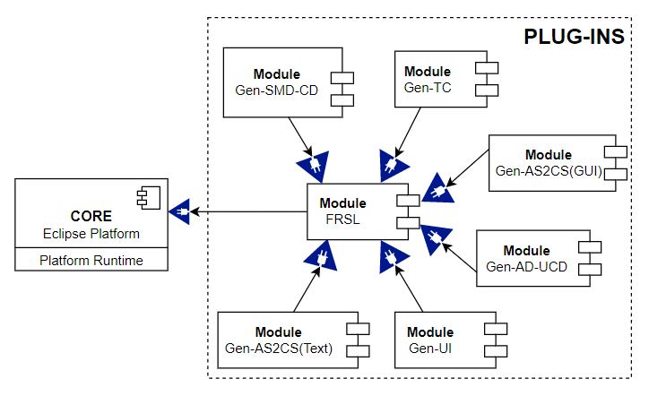

# Functional Requirements Specification Language (FRSL)
**Acronyms:**
- SMD: State Machine Diagram.
- CD: Class Diagram.
- AS2CS: Abstract Syntax To Concrete Syntax.
- TC: Test case.
- UI: User Interface.
- AD: Activity Diagram.
- UCD: Use Case Diagram.
- ...

**Prerequisites:**
- Install [Eclipse DSL Tools (Version: 2022-03)](https://www.eclipse.org/downloads/packages/release/2022-03/r/eclipse-ide-java-and-dsl-developers).
- Install plugin Sirius 7.0: *Help -> Eclipse Marketplace -> Search "Sirius 7.0" -> Install -> Next ...*
- Clone this repo.
- Open repo: 
  - *File -> Open Project From File System -> Specify to folder 'plugins' -> Deselect the 'plugins' checkbox -> finish*.
  - *File -> Open Project From File System -> Specify to folder 'examples' -> Deselect the 'examples' checkbox -> finish*.
- In *Problem* section (in Eclipse):
  - If any project is missing *src-gen*, add manually folder *src-gen* to that project.
  - ...

**Plugin Architecture:**

## Plugin Gen-SMD-CD + Gen-AS2CS(Text)
**Prerequisites:**
- Install [Papyrus Plugin (By Update Sites)](https://download.eclipse.org/modeling/mdt/papyrus/updates/releases/2022-03): *Help -> Install New Software -> Paste link to "Work with"-> Enter -> Tick all package -> Next ...*

**Note:**

- Can gen SMD, CD from *.frsl* file OR *.frslas* file.
- Can gen *.frslas* file from *.frsl* file.
- Can gen *.frsl* file from *.frslas* file.

**Usage\:**

- Run runtime: *Right click to any project -> Run As -> Eclipse Application*.
- In runtime environment, create general project: *File -> New Project -> General -> Project -> Next ...*
- In general project, create .frsl file: *Right click -> New -> File -> Set name "test.frsl" -> Finish*
- Gen SMD, CD from *.frsl* file:
  - Open *.frsl* file -> Right click on white space in file -> FRSLCS -> Save As -> UML.
- Gen *.frslas* from *.frsl* file:
  - Open *.frsl* file -> Right click on white space in file -> FRSLCS -> Save As -> FRSLAS.
- Gen SMD, CD from *.frslas* file:
  - Open *.frslas* file -> Right click on file icon -> FRSLCS -> Generate Smc Uml.
- Gen *.frsl* file from *.frslas* file:
  - Open *.frslas* file -> Right click on file icon -> FRSLCS -> Generate Frslcs.
- Visual UML diagram (by Papyrus Plugin):
  - Right click file icon .uml -> New -> Papyrus Model -> Finish
  - To Visual Class Diagram:
    - In 'Model Explorer' section, right click top-level meta-concept -> New Diagram -> Class Diagram
    - Right click on white space -> Filters -> Synchronized with model.
    - Ctrl+A -> Right click on white space -> Filters -> Show/Hide Contents.
  - To Visual State Machine Diagram:
    - In 'Model Explorer' section, right click 'StateMachine' meta-concept -> New Diagram -> State Machine Diagram
    - Right click on white space -> Filters -> Synchronized with model.
    - Ctrl+A -> Right click on white space -> Filters -> Show/Hide Contents.

## Plugin Gen-AS2CS(GUI)

...
## Plugin Gen-TC

...
## Plugin Gen-AD-UCD

...
## Plugin Gen-UI

...

