# frsl-genTestCases

**Prerequisites:**
- Install [Eclipse DSL Tools (Version: 2022-03)](https://www.eclipse.org/downloads/packages/release/2022-03/r/eclipse-ide-java-and-dsl-developers).
- Install plugin Sirius 7.0: *Help -> Eclipse Marketplace -> Search "Sirius 7.0" -> Install -> Next ...*
- Clone [frsl-all repo](https://github.com/vnu-dse/frsl.git).
- Open repo: 
  - *File -> Open Project From File System -> Specify to folder 'plugins' -> Deselect the 'plugins' checkbox -> finish*.
  - *File -> Open Project From File System -> Specify to folder 'examples' -> Deselect the 'examples' checkbox -> finish*.
- In *Problem* section (in Eclipse):
  - If any project is missing *src-gen*, add manually folder *src-gen* to that project.
- Install plugin Acceleo
- Create new project Acceleo and add content from file 'AcceleoFilmstrip' from this repo
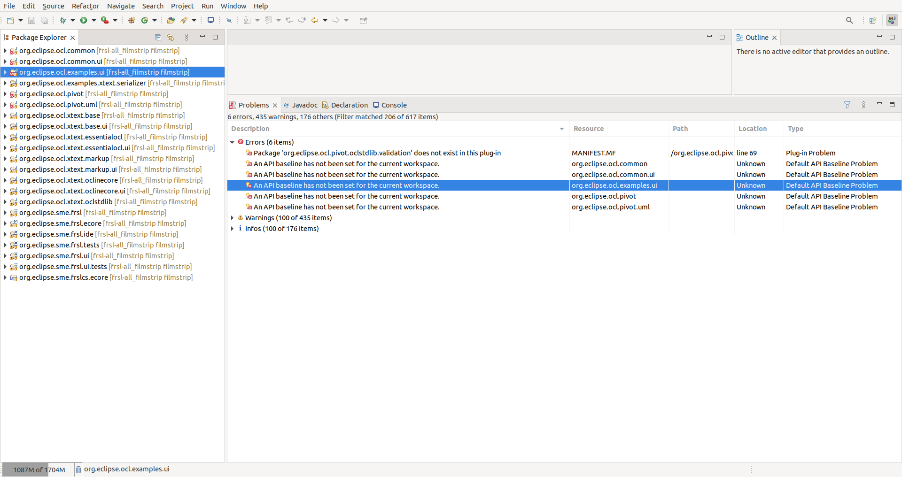
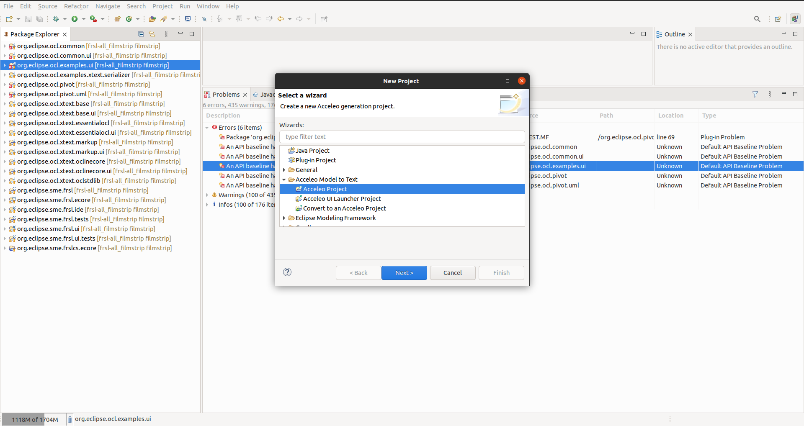
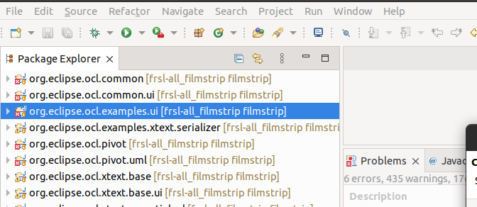
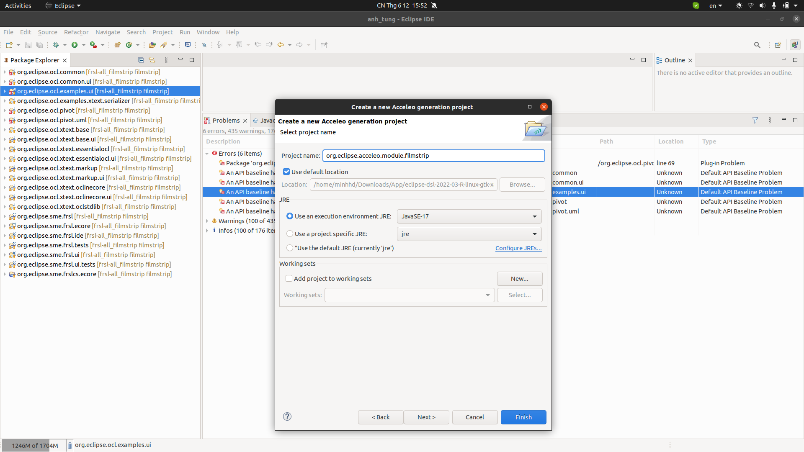
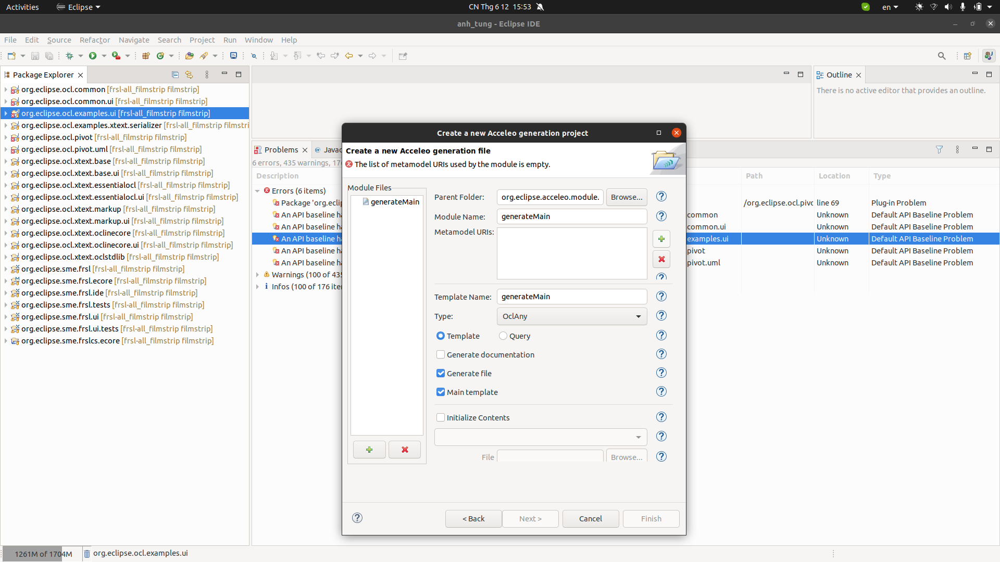
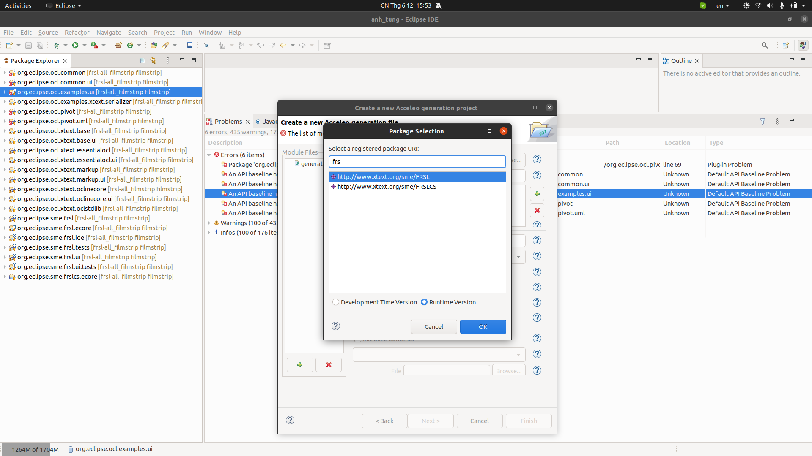
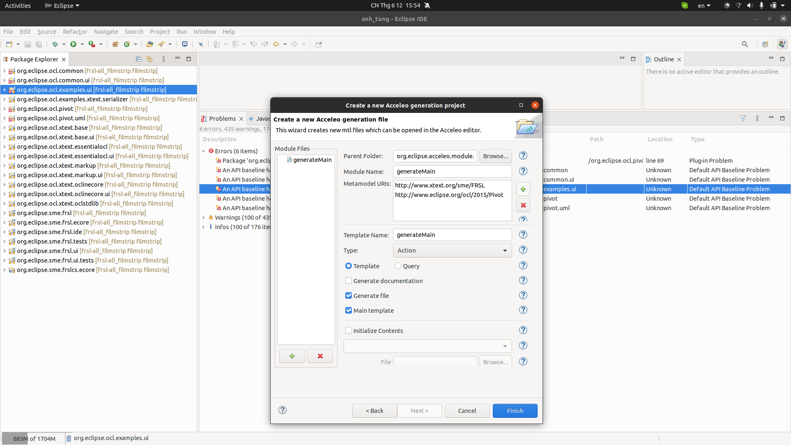
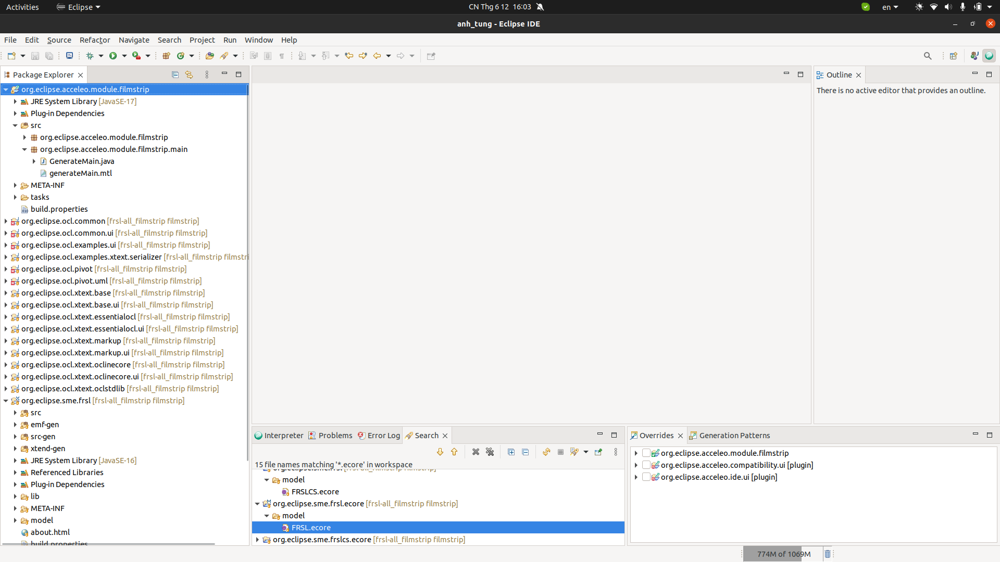
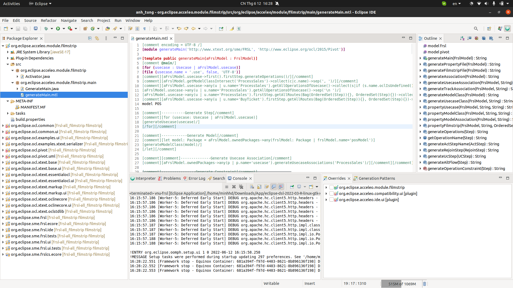
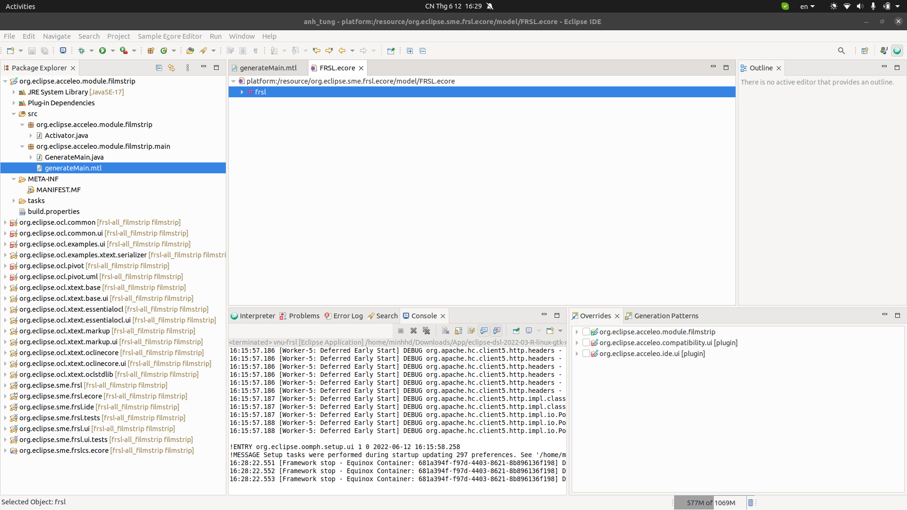
- Right click Acceleo project and click Acceleo -> Create Acceleo UI Launcher Project
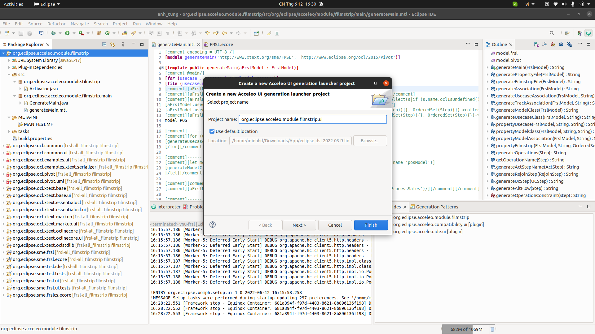

**Usage\:**

- Run runtime: *Right click to any project -> Run As -> Eclipse Application*.
- In runtime environment, create general project: *File -> New Project -> General -> Project -> Next ...*
- In general project, create .frsl file: *Right click -> New -> File -> Set name "test.frsl" -> Finish*
- Gen Filmstrip artifacts from *.frsl* file:
  - Open *.frsl* file -> Right click on white space in editor -> OCL -> Save as -> FRSLAS.
  - Open *.frslas* file -> Right click on white space in editor -> Acceleo -> Generate Filmstrip (or sth like that).
- Gen data with USE tool:
  - Open USE tool, then open *.use file
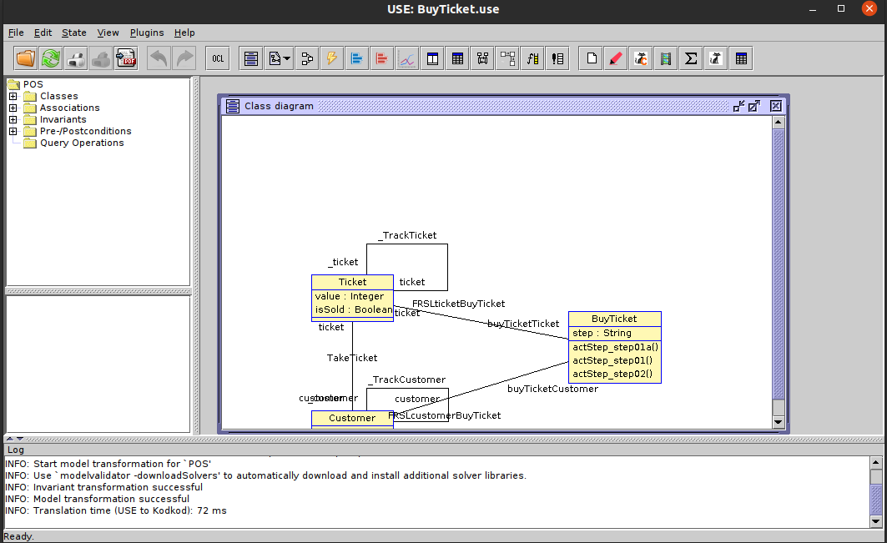
  - Click Filmstrip plugin, set Destination file to *.filmstrip.use generated file, set Tranformation method to Model validator compatible transformation with tenary association. Then press Ok.
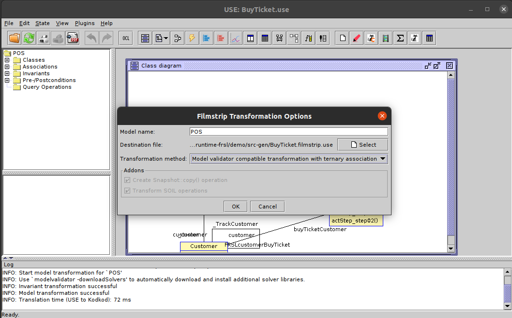
  - Open *.filmstrip.use generated file, click Model validator plugin. Choose configuration for the path to generate testcase.
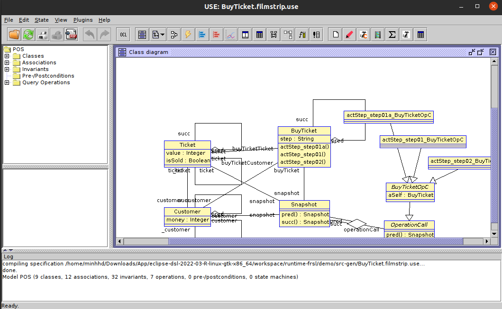
  - Testcase data result will be visualized in object diagram
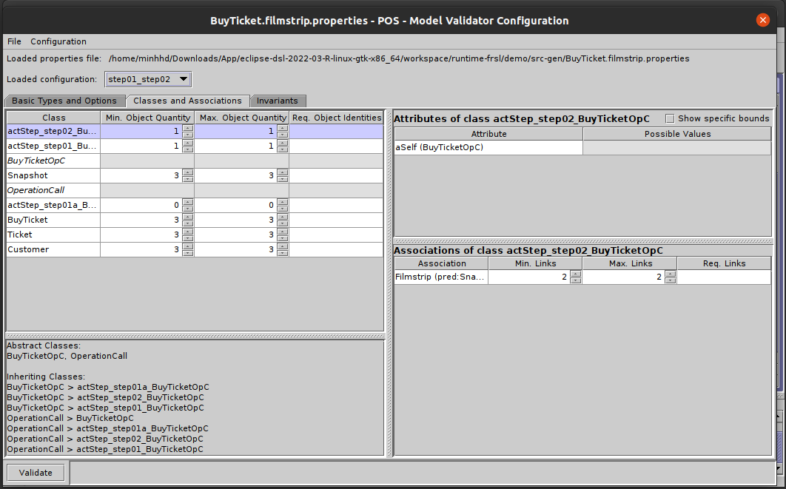
  - Right click and choose Swimlane layout
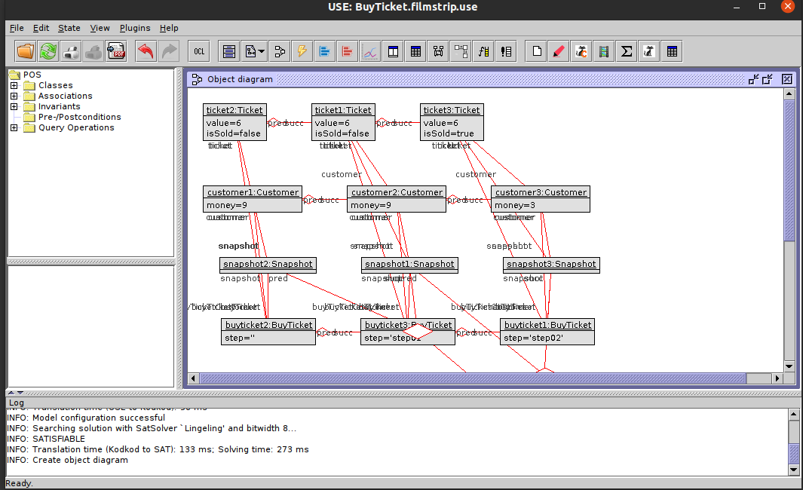